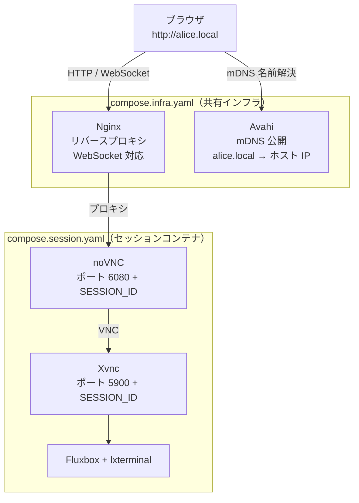

# novnc-docker

ブラウザからデスクトップ環境にアクセスできる、マルチユーザー対応のセッション管理システムです。  
Docker + noVNC + Nginx + mDNS (Avahi) を組み合わせて、`http://<コンテナ名>.local` という URL でセッションに接続できます。

ROS 2 Jazzy と通常の Linux（Ubuntu 24.04）の 2 種類のセッションタイプをサポートします。

## アーキテクチャ



### コンポーネント

| コンポーネント | 役割 |
|---|---|
| `compose.infra.yaml` | 共有インフラ（Nginx・Avahi）。全セッションで 1 つだけ起動 |
| `compose.session.yaml` | セッションコンテナ。ユーザーごとに独立したスタックとして起動 |
| `Dockerfile.ros2` | ROS 2 Jazzy + TigerVNC + noVNC + Fluxbox の環境イメージ |
| `Dockerfile.linux` | Ubuntu 24.04 + TigerVNC + noVNC + Fluxbox の環境イメージ |
| `entrypoint.sh` | SESSION_ID に基づきポートを割り当てて VNC/noVNC を起動 |
| `orchestrator.py` | セッションの起動・停止・Nginx 設定・mDNS 登録を自動化 |

## セッションタイプ

| `--type` | ベースイメージ | ビルドファイル | 用途 |
|---|---|---|---|
| `ros2`（デフォルト） | `osrf/ros:jazzy-desktop` | `Dockerfile.ros2` | ROS 2 Jazzy 開発環境 |
| `linux` | `ubuntu:24.04` | `Dockerfile.linux` | 汎用 Linux デスクトップ |

## 前提条件

- Docker（Compose プラグイン含む）
- Python 3.12 以上
- LAN 内の他マシンから接続する場合は mDNS（Bonjour/Avahi）が利用可能な環境

## インストール

```bash
git clone https://github.com/atomon/novnc-docker
cd novnc-docker
```

## 使い方

### セッションの起動

```bash
# ROS 2 セッション（デフォルト）
python orchestrator.py start alice

# Linux セッション
python orchestrator.py start bob --type linux
```

起動後、同一 LAN 内のブラウザから `http://<コンテナ名>.local` でアクセスできます。  
VNC パスワードは不要です（`SecurityTypes None`）。

すでに起動済みのセッションに再度 `start` を実行した場合はスキップされ、URL が表示されます。

### セッションの停止

```bash
python orchestrator.py stop alice
```

コンテナの削除・Nginx 設定の削除・mDNS の登録解除を一括で行います。

### セッション一覧の確認

```bash
python orchestrator.py list
```

起動中の全セッションと共有インフラ（`novnc_infra`）を一覧表示します。

## ポート割り当て

SESSION_ID は 10 から自動採番されます（最大 100 セッション）。

| 用途 | ポート |
|---|---|
| VNC | `5900 + SESSION_ID` |
| noVNC (WebSocket) | `6080 + SESSION_ID` |

同一ホスト上でセッションが増えても衝突しません。

## 環境変数

`compose.session.yaml` で参照される変数（`orchestrator.py` が自動で設定します）。

| 変数 | 説明 |
|---|---|
| `SESSION_ID` | セッションの識別番号（10〜109） |
| `CONTAINER_NAME` | コンテナ名兼 mDNS ホスト名 |
| `DOCKERFILE` | 使用する Dockerfile（`Dockerfile.ros2` または `Dockerfile.linux`） |
| `IMAGE_NAME` | ビルド・使用するイメージ名 |
| `ROS_DOMAIN_ID` | ROS 2 のドメイン ID（デフォルト: 0） |

## インフラのバージョン管理

インフラコンテナ（`nginx_proxy` / `avahi_mdns`）には `novnc.infra.version` ラベルが付与されており、バージョンが一致しない既存コンテナが検出された場合はエラーで停止します。

```
RuntimeError: 既存のインフラコンテナのバージョンが一致しません。先に停止してください: docker compose -f compose.infra.yaml down
```

古いインフラを停止してから再度 `start` を実行してください。

```bash
docker compose -f compose.infra.yaml down
python orchestrator.py start alice
```

## ライセンス

[LICENSE](./LICENSE) を参照してください。
