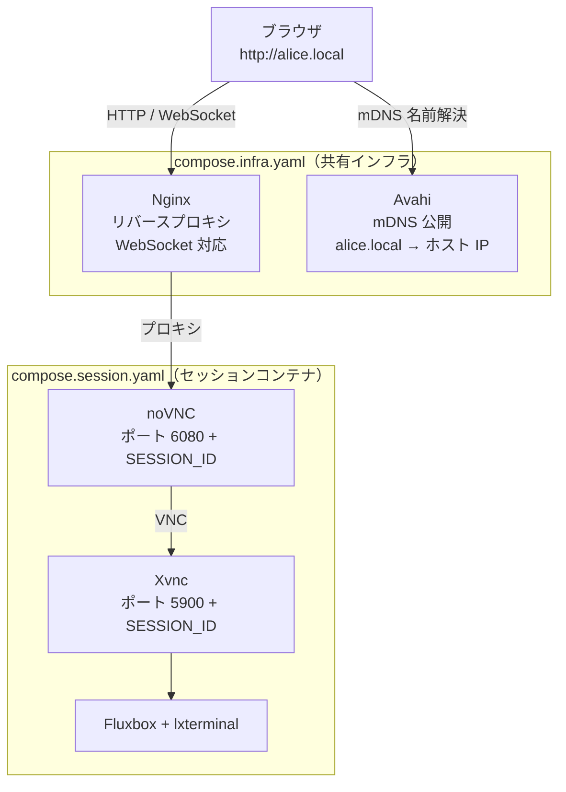
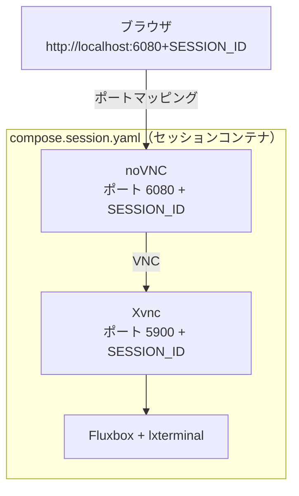

# novnc-docker

ブラウザからデスクトップ環境にアクセスできる、マルチユーザー対応のセッション管理システムです。

## 特長

- **macOS・Linux 両対応** — OS を問わず同じコマンドで操作できます
- **マルチユーザー対応** — 複数セッションを同時起動でき、ポートは自動採番されます
- **2 種類のセッションタイプ** — ROS 2 Jazzy 開発環境と汎用 Ubuntu 24.04 デスクトップ
- **シンプルな CLI** — `start` / `stop` / `list` の 3 コマンドで操作完結
- **Linux**: Nginx + mDNS (Avahi) 経由で `http://<コンテナ名>.local` から LAN 内アクセス
- **macOS**: ポートマッピング経由で `http://localhost:<ポート>` からローカルアクセス

## クイックスタート

```bash
# セッション起動（ROS 2）
python orchestrator.py start alice

# セッション起動（Ubuntu Linux）
python orchestrator.py start bob --type linux

# セッション停止
python orchestrator.py stop alice

# セッション一覧
python orchestrator.py list
```

起動完了時にアクセス URL が表示されます。VNC パスワードは不要です。

## セッションタイプ

| `--type` | ベースイメージ | 用途 |
|---|---|---|
| `ros2`（デフォルト） | `ros:jazzy` | ROS 2 Jazzy 開発環境 |
| `linux` | `ubuntu:24.04` | 汎用 Linux デスクトップ |

## 前提条件

- Docker（Compose プラグイン含む）
- **Linux のみ**: LAN 内の他マシンから接続する場合は mDNS（Avahi）が利用可能な環境
- **macOS**: Docker Desktop が動作すれば追加要件なし

## インストール

```bash
git clone https://github.com/atomon/novnc-docker
cd novnc-docker
```

---

## 詳細

### アーキテクチャ

#### Linux

Nginx がリバースプロキシとして機能し、Avahi が mDNS でホスト名を LAN に公開します。



#### macOS

Nginx・Avahi は起動せず、セッションコンテナのポートをホストに直接マッピングします。



### コンポーネント

| コンポーネント | 役割 |
|---|---|
| `compose.infra.yaml` | 共有インフラ（Nginx・Avahi）。全セッションで 1 つだけ起動 |
| `compose.session.yaml` | セッションコンテナ。ユーザーごとに独立したスタックとして起動 |
| `Dockerfile.ros2` | ROS 2 Jazzy + TigerVNC + noVNC + Fluxbox の環境イメージ |
| `Dockerfile.linux` | Ubuntu 24.04 + TigerVNC + noVNC + Fluxbox の環境イメージ |
| `entrypoint.sh` | SESSION_ID に基づきポートを割り当てて VNC/noVNC を起動 |
| `orchestrator.py` | セッションの起動・停止・Nginx 設定・mDNS 登録を自動化 |

### ポート割り当て

SESSION_ID は 10 から自動採番されます（最大 100 セッション）。

| 用途 | ポート |
|---|---|
| Nginx (HTTP) | `NGINX_PORT`（デフォルト: `80`） |
| VNC | `5900 + SESSION_ID` |
| noVNC (WebSocket) | `6080 + SESSION_ID` |

Nginx のポートを変更する場合は `orchestrator.py` の `NGINX_PORT` を編集します。

```python
NGINX_PORT = 8080  # http://alice.local:8080 でアクセス
```

### 環境変数

`orchestrator.py` がセッション起動時に自動設定します。

| 変数 | 説明 |
|---|---|
| `SESSION_ID` | セッションの識別番号（10〜109） |
| `CONTAINER_NAME` | コンテナ名兼 mDNS ホスト名 |
| `DOCKERFILE` | 使用する Dockerfile |
| `IMAGE_NAME` | ビルド・使用するイメージ名 |
| `NOVNC_PORT` | noVNC のポート番号（`6080 + SESSION_ID`）。macOS のポートマッピングで使用 |
| `ROS_DOMAIN_ID` | ROS 2 のドメイン ID（デフォルト: 0） |

### インフラのバージョン管理

インフラコンテナ（`nginx_proxy` / `avahi_mdns`）にはバージョンラベルが付与されており、不一致が検出された場合はエラーで停止します。

```
RuntimeError: 既存のインフラコンテナのバージョンが一致しません。先に停止してください: docker compose -f compose.infra.yaml down
```

古いインフラを停止してから再度 `start` を実行してください。

```bash
docker compose -f compose.infra.yaml down
python orchestrator.py start alice
```

## ライセンス

[LICENSE](./LICENSE) を参照してください。
